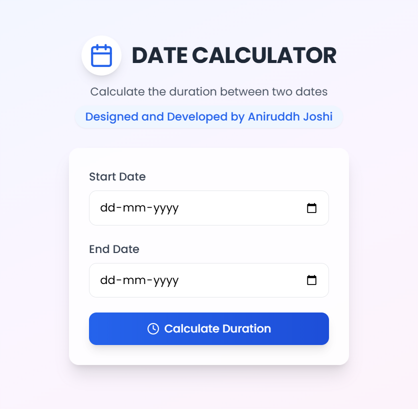

# Date Calculator 🗓️🚀  

A simple web app to calculate the difference between dates, add/subtract days, and perform date-related operations.  

  

## 🔗 Live Demo  
[https://aniruddh-date-calculator.netlify.app/](https://aniruddh-date-calculator.netlify.app/)  

## 📌 Features  
✅ Calculate the number of days between two dates  
✅ Add or subtract days from a specific date  
✅ User-friendly and responsive design  

## 📥 Installation  
1. Clone the repository:  
   ```bash
   git clone https://github.com/aniruddh-joshi/date-calculator.git
2. Navigate to the project folder and open index.html in your browser.

## 📜 License
This project is open-source and available under the MIT License.

##👨‍💻 Developed by Aniruddh Joshi
